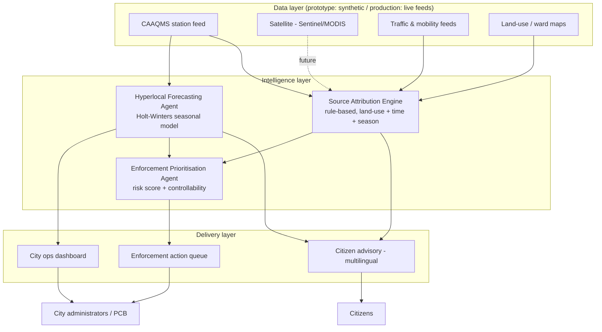

# AeroSense — Urban Air Quality Intelligence

Built for **ET AI Hackathon 2026** (Economic Times Digital) — problem statement: *AI-Powered Urban Air Quality Intelligence for Smart City Intervention*.

**Live idea in one line:** most Indian cities already have the sensor data (900+ CAAQMS stations under NCAP) — what's missing is the layer that turns a reading into a decision. AeroSense takes ward-level AQI, attributes it to a source, forecasts where it's headed, and tells a specific official what to do about it today, in a language a citizen actually reads in.

## What's actually working in this prototype

| Module | What it does | File |
|---|---|---|
| City/ward dashboard | Live AQI snapshot per ward with band classification | `assets/js/app.js` (`renderDashboard`) |
| Hyperlocal forecasting | 72h AQI forecast using an additive Holt-Winters model (24h seasonality) with a confidence band | `assets/js/forecast.js` |
| Source attribution | Rule-based apportionment across vehicular / industrial / construction / biomass / meteorological, driven by ward land-use, time of day, and season | `assets/js/attribution.js` |
| Enforcement prioritisation | Ranks wards by `severity × population exposed × source controllability`, and names the specific action for the dominant source | `assets/js/enforcement.js` |
| Citizen advisory | CPCB-band health guidance in English / Hindi / Kannada / Tamil, plus a small template-matching Q&A assistant | `assets/js/advisory.js` |

It's a static site — open `index.html`, or serve the folder with anything (`python -m http.server`, `npx serve`, GitHub Pages, Netlify). No backend, no API keys, no build step. That's a deliberate choice for a demo: it has to run on stage even if the venue wifi doesn't cooperate.

## Why the data is synthetic (and what would change in production)

CAAQMS station APIs aren't openly accessible enough to hotlink live for a hackathon demo, so `assets/js/data.js` generates a realistic hourly series per ward — diurnal traffic humps, a flatter industrial baseline, a winter biomass-burning bump for Delhi/Kolkata in Jan — using known, documented patterns rather than random noise. Every downstream module (`forecast.js`, `attribution.js`, `enforcement.js`) only depends on the shape `{ t, aqi }`, so plugging in a real feed (CPCB CAAQMS, or the AQICN public API) is a one-function swap, not a rewrite.

Same honesty applies to the two "AI" pieces:
- **Forecasting** is a real, working Holt-Winters implementation — not a mocked number. It's a legitimate baseline, and the doc explains where a heavier model (LSTM/dispersion-model ensemble trained on met + satellite data) would slot in for production.
- **Source attribution** is a transparent rules engine, not a black box — because for a first version, explainability (showing *why* a ward got flagged) matters more than squeezing out a few more points of accuracy from an unvalidated model. The submission doc is explicit that this is an MVP baseline, not something benchmarked against a real receptor-modelling (CMB/PMF) study — that benchmarking is exactly what a pilot with a city's pollution control board would do next.

## Architecture

## Roadmap beyond the hackathon build

1. Replace the synthetic series with a live CAAQMS/AQICN feed per ward.
2. Swap the rule-based attribution engine for a receptor-modelling-informed classifier (CMB/PMF-style), validated against a city PCB's existing source-apportionment study.
3. Add satellite thermal-anomaly data (stubble burning detection) to the biomass signal instead of a season flag.
4. Move the citizen Q&A from template-matching to an LLM layer for open-ended questions, keeping the CPCB health-advisory text as ground truth so the model can't hallucinate a wrong safety recommendation.
5. Wire the enforcement queue into an actual municipal ticketing system so "recommended action" becomes a tracked task, not just a row in a table.

## Team

Nilesh Yadav

## License

MIT — see `LICENSE`.
